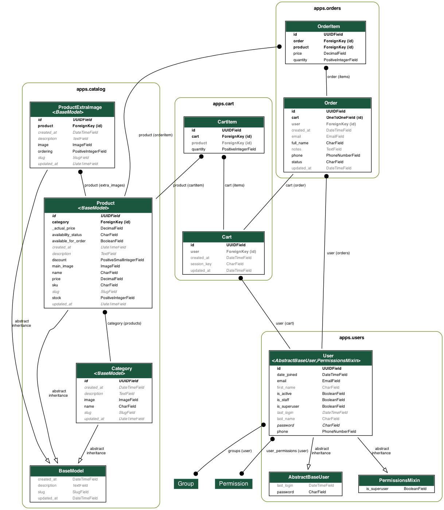

# База данных

## ER-диаграмма

## Основные таблицы

### Пользователи (`users_user`)
| Поле           | Тип               | Ограничения/Индексы                     | Описание                                                                 |
|----------------|-------------------|----------------------------------------|--------------------------------------------------------------------------|
| `id`           | `UUID`            | `PK`                                   | Первичный ключ                                                           |
| `email`        | `VARCHAR(255)`    | `UNIQUE`, `INDEX`                      | Уникальный email (используется для аутентификации)                       |
| `phone`        | `PhoneNumberField`| `INDEX (частичный)`                    | Номер телефона в формате +7XXXXXXXXXX (неуникальный, регион: RU)         |
| `first_name`   | `VARCHAR(255)`    | `BLANK=True`                           | Имя пользователя                                                         |
| `last_name`    | `VARCHAR(255)`    | `BLANK=True`                           | Фамилия пользователя                                                     |
| `is_active`    | `BOOLEAN`         | `DEFAULT=True`                         | Статус активности                                                        |
| `is_staff`     | `BOOLEAN`         | `DEFAULT=False`                        | Доступ к админке                                                         |
| `is_superuser` | `BOOLEAN`         | `DEFAULT=False`                        | Суперпользователь (наследуется из `PermissionsMixin`)                    |
| `date_joined`  | `TIMESTAMP`       | `DEFAULT=timezone.now`                 | Дата регистрации                                                         |
| `password`     | `VARCHAR(128)`    | `NOT NULL`                             | Хэшированный пароль (наследуется из `AbstractBaseUser`)                  |
| `last_login`   | `TIMESTAMP`       | `NULL=True`                            | Дата последней авторизации                                               |

---
### Категории (`catalog_category`)
| Поле         | Тип               | Ограничения/Индексы                     | Описание                                                                 |
|--------------|-------------------|----------------------------------------|--------------------------------------------------------------------------|
| `id`         | `UUID`            | `PK`                                   | Первичный ключ                                                           |
| `name`       | `VARCHAR(100)`    | `UNIQUE`                               | Название категории (автоматически капитализируется при сохранении)       |
| `slug`       | `VARCHAR(150)`    | `UNIQUE`                               | ЧПУ-идентификатор (генерируется автоматически из названия)               |
| `image`      | `VARCHAR(255)`    | `DEFAULT="catalog/default.png"`        | Путь к изображению категории                                             |
| `description`| `TEXT`            | `NULL=True`                            | Описание категории                                                       |
| `created_at` | `TIMESTAMP`       | `DEFAULT=timezone.now`                 | Дата создания (автоматически заполняется)                                |
| `updated_at` | `TIMESTAMP`       | `DEFAULT=timezone.now`                 | Дата последнего обновления (автоматически обновляется)                   |

**Особенности:**
- **Автоматическая генерация `slug`:**
  Значение `slug` создаётся из названия категории через транслитерацию (например, "Мебель для гостиной" → `mebel-dlya-gostinoy`).
- **Капитализация названия:**
  Поле `name` автоматически приводится к формату с заглавной буквы (например, "стулья" → "Стулья").
- **Сортировка:**
  Категории упорядочены по алфавиту (`ordering = ["name"]`).

### Товары (`catalog_product`)
| Поле           | Тип               | Ограничения/Индексы                     | Описание                                                                 |
|----------------|-------------------|----------------------------------------|--------------------------------------------------------------------------|
| `id`           | `UUID`            | `PK`                                   | Первичный ключ                                                           |
| `name`         | `VARCHAR(200)`    |                                        | Название товара (автоматически капитализируется при сохранении)          |
| `sku`          | `VARCHAR(50)`     | `UNIQUE`, `INDEX`                      | Артикул товара (например, `PROD-001`)                                    |
| `price`        | `DECIMAL(10,2)`   | `INDEX`, `CHECK (>= 0)`                | Базовая цена (используется для расчета `actual_price`)                   |
| `discount`     | `SMALLINT`        | `DEFAULT=0`, `CHECK (0 <= discount <= 100)` | Скидка в процентах (автоматически рассчитывает `actual_price`)           |
| `stock`        | `INT`             | `DEFAULT=0`, `CHECK (>= 0)`            | Остаток на складе                                                        |
| `category_id`  | `UUID`            | `FK (catalog_category), NULL=True`     | Связь с категорией (при удалении категории — NULL)                       |
| `main_image`   | `VARCHAR(255)`    | `DEFAULT="catalog/default.png"`        | Путь к основному изображению                                             |
| `slug`         | `VARCHAR(150)`    | `UNIQUE`, `INDEX`                      | ЧПУ-идентификатор (генерируется из `name` и `sku`)                       |
| `description`  | `TEXT`            | `NULL=True`                            | Описание товара (наследуется из `BaseModel`)                             |
| `created_at`   | `TIMESTAMP`       | `DEFAULT=timezone.now`                 | Дата создания (автоматически заполняется)                                |
| `updated_at`   | `TIMESTAMP`       | `DEFAULT=timezone.now`                 | Дата последнего обновления (автоматически обновляется)                   |

**Особенности:**
- **Автоматическая генерация `slug`:**
  Значение `slug` создаётся из `name` и `sku` через транслитерацию (например, "Стул деревянный (STL-001)" → `stul-derevyannyi-stl-001`).
- **Расчет `actual_price`:**
  `actual_price = price * (100 - discount) / 100` (округляется до 2 знаков).
- **Индексы:**
  Для полей `sku`, `price`, `slug` созданы отдельные индексы для ускорения поиска.

---

### Доп. изображения (`catalog_productextraimage`)
| Поле           | Тип               | Ограничения/Индексы                     | Описание                                                                 |
|----------------|-------------------|----------------------------------------|--------------------------------------------------------------------------|
| `id`           | `UUID`            | `PK`                                   | Первичный ключ                                                           |
| `product_id`   | `UUID`            | `FK (catalog_product)`                 | Связь с товаром                                                          |
| `image`        | `VARCHAR(255)`    |                                        | Путь к дополнительному изображению                                       |
| `ordering`     | `INT`             | `DEFAULT=0`, `CHECK (>= 0)`            | Порядок отображения (автоматически увеличивается при добавлении)         |
| `created_at`   | `TIMESTAMP`       | `DEFAULT=timezone.now`                 | Дата создания (наследуется из `BaseModel`)                               |
| `updated_at`   | `TIMESTAMP`       | `DEFAULT=timezone.now`                 | Дата последнего обновления (наследуется из `BaseModel`)                  |

**Особенности:**
- **Автоматический порядок изображений:**
  Если `ordering` не указан, присваивается значение `последний_ordering + 1`.
- **Сортировка:**
  Изображения упорядочены по полю `ordering` (от меньшего к большему).
### Корзина (`cart_cart`)
| Поле           | Тип               | Ограничения/Индексы                     | Описание                                                                 |
|----------------|-------------------|----------------------------------------|--------------------------------------------------------------------------|
| `id`           | `UUID`            | `PK`                                   | Первичный ключ                                                           |
| `user`         | `UUID`            | `FK (users_user), NULL=True`           | Связь с пользователем (NULL для анонимов)                                |
| `session_key`  | `VARCHAR(40)`     | `NULL=True`                            | Ключ сессии для анонимных пользователей                                  |
| `created_at`   | `TIMESTAMP`       | `DEFAULT=timezone.now`                 | Дата создания корзины                                                    |
| `updated_at`   | `TIMESTAMP`       | `DEFAULT=timezone.now`                 | Дата последнего обновления                                               |
| **Ограничение**|                   | `CHECK (user IS NOT NULL OR session_key IS NOT NULL)` | Гарантирует наличие либо пользователя, либо сессии                       |

**Особенности:**
- **Автоматическая привязка:**
  Для анонимов используется `session_key`, для авторизованных — `user`.
- **Метод `total`:**
  Рассчитывает общую сумму корзины: `sum(item.total_price for item in items.all())`.

---

### Товары корзины (`cart_cartitem`)
| Поле           | Тип               | Ограничения/Индексы                     | Описание                                                                 |
|----------------|-------------------|----------------------------------------|--------------------------------------------------------------------------|
| `id`           | `UUID`            | `PK`                                   | Первичный ключ                                                           |
| `cart`         | `UUID`            | `FK (cart_cart)`                       | Связь с корзиной                                                         |
| `product`      | `UUID`            | `FK (catalog_product)`                 | Связь с товаром                                                          |
| `quantity`     | `INT`             | `>=1`                                  | Количество товара                                                        |
| `price`        | `DECIMAL(10,2)`   |                                       | Цена товара на момент добавления в корзину                               |
| **Ограничение**|                   | `UNIQUE (cart, product)`               | Запрещает дублирование товаров в одной корзине                           |

**Особенности:**
- **Проверка остатков:**
  При сохранении проверяется, что `quantity <= product.stock`.
- **Автоматическая установка цены:**
  Если `price` не указан, используется `product.actual_price`.
- **Метод `total_price`:**
  Рассчитывает стоимость позиции: `price * quantity` (округляется до 2 знаков).

---
### Заказы (`orders_order`)
| Поле           | Тип               | Ограничения/Индексы                     | Описание                                                                 |
|----------------|-------------------|----------------------------------------|--------------------------------------------------------------------------|
| `id`           | `UUID`            | `PK`                                   | Первичный ключ                                                           |
| `cart`         | `UUID`            | `OneToOne (cart_cart)`                 | Связанная корзина (удаляется при удалении заказа)                        |
| `full_name`    | `VARCHAR(255)`    |                                        | ФИО получателя                                                           |
| `phone`        | `PhoneNumberField`| `INDEX (частичный)`                    | Контактный номер (формат: +7XXXXXXXXXX)                                  |
| `email`        | `VARCHAR(255)`    | `NULL=True`                            | Контактный email (опционально)                                           |
| `status`       | `VARCHAR(20)`     | `ENUM: new, processing, completed, cancelled` | Статус заказа (по умолчанию: `new`)                              |
| `created_at`   | `TIMESTAMP`       | `DEFAULT=timezone.now`                 | Дата создания                                                             |
| `updated_at`   | `TIMESTAMP`       | `DEFAULT=timezone.now`                 | Дата последнего обновления                                               |

**Особенности:**
- **Связь с корзиной:**
  Используется `OneToOneField` для строгой связи с корзиной (`on_delete=models.Cascade`  удаление корзины при оформлении заказа).
- **Метод `total`:**
  Рассчитывает общую стоимость: `sum(item.total_price for item in items.all())`.
- **Статусы:**
  - `new` — заказ создан, но не обработан
  - `processing` — в работе
  - `completed` — завершён
  - `cancelled` — отменён

---

### Товары заказа (`orders_orderitem`)
| Поле           | Тип               | Ограничения/Индексы                     | Описание                                                                 |
|----------------|-------------------|----------------------------------------|--------------------------------------------------------------------------|
| `id`           | `UUID`            | `PK`                                   | Первичный ключ                                                           |
| `order`        | `UUID`            | `FK (orders_order)`                    | Связь с заказом                                                          |
| `product`      | `UUID`            | `FK (catalog_product)`                 | Связь с товаром                                                          |
| `quantity`     | `INT`             | `>=1`                                  | Количество товара                                                        |
| `price`        | `DECIMAL(10,2)`   |                                        | Цена товара на момент оформления заказа                                  |
| **Ограничение**|                   | `UNIQUE (order, product)`              | Запрещает дублирование товаров в одном заказе                            |

**Особенности:**
- **Проверка остатков:**
  При сохранении проверяется, что `quantity <= product.stock`.
- **Автоматическая установка цены:**
  Если `price` не указан, используется `product.actual_price`.
- **Метод `total_price`:**
  Рассчитывает стоимость позиции: `price * quantity` (округляется до 2 знаков).

---

## Бизнес-логика
### Обработка заказов
1. **Сервис `OrderService`:**
   - **`create_order_from_cart`:**
     - Создаёт заказ из корзины с проверкой остатков.
     - Уменьшает `stock` товаров в каталоге.
     - Удаляет корзину после успешного создания заказа.
   - **`cancel_order`:**
     - Возвращает товары на склад при отмене.
     - Запрещена отмена завершённых заказов.

2. **Транзакции:**
   Методы `create_order_from_cart` и `cancel_order` выполняются в атомарных транзакциях.

3. **Валидации:**
   - Запрет создания заказа с пустой корзиной.
   - Проверка доступного количества товаров перед оформлением.

### Работа с корзиной
1. **Сервис `CartService`:**
   - **`get_or_create_cart(request)`:**
     Создаёт корзину для анонимов/авторизованных пользователей.
   - **`add_to_cart(cart, product, quantity)`:**
     Добавляет товар в корзину с проверкой остатков. Если товар уже есть — увеличивает количество.

2. **Валидации:**
   - В `CartItem` запрещено сохранение, если `quantity > product.stock`.
   - В `Cart` запрещено сохранение, если отсутствуют и `user`, и `session_key`.

3. **Транзакции:**
   Метод `add_to_cart` выполняется в атомарной транзакции для обеспечения целостности данных.
